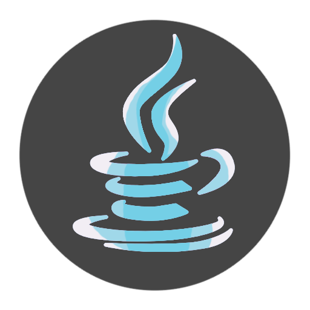
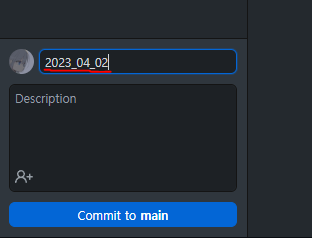

# BaekJoon-Study (*백준 스터디)

   

## 👋About

- 백준 알고리즘 스터디용 찻집

   

## 💬참여 인원 

|ABER1047|lhetl|VIichan16|igottoomany|
|---|---|---|---|
|||||
|<a href = "https://github.com/ABER1047">Github</a>|<a href = "https://github.com/lhetl">Github</a>|<a href = "https://github.com/VIichan16">Github</a>|<a href = "https://github.com/igottoomany">Github</a>|

   

## 📖진행 방식

* **매주 최소 한 문제씩** 풀어 **소스코드를 각자의 폴더 안에 업로드(커밋)** 합니다
  - ##### 문제는 각자의 수준에 맞는 문제를 풀며, 본인이 너무 쉽다고 느끼거나, 시간적 여유가 있으면 더 많이 풉니다)
  - ##### 파일을 커밋할 때, 제목을 해당 파일의 업로드 날짜로 합니다 (아래 사진 참고)
     

- **프로그래밍 언어**는 자신이 **선호하는 언어**로 사용합니다

- 문제를 풀다가 막히는 부분은 **디스코드를 통해 서로 질문하고 답변**합니다

   

